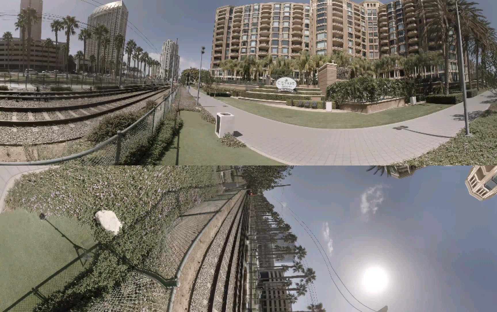

## Region-wise Packing and Tile Based Viewport-adaptive Streaming for Immersive Media
- <b>연구제목</b> : 몰입형 미디어를 위한 영역 기반 패킹과 타일 기반 사용자 시점 적응적 스트리밍
- <b>연구기간</b> : 2021.03.02. - 2021.06.03.
- <b>참여자</b> : 김서진, 김희동, 윤서영

### 연구 배경
360도 영상 처리를 위한 moving picture experts group (MPEG) 산하 표준인 omnidirectional media format (OMAF) 기반의 효율적인 몰입형 미디어 스트리밍 방법을 연구하는 것을 초기 연구 주제로 선정하였습니다. 360도 영상 스트리밍 시 종래의 디바이스의 처리 능력을 상회하는 해상도와 frames per second (FPS), 지연 시간 (motion-to-photon latency; MTP latency)을 극복하기 위해 타일, RWP를 사용한 방법이 제안되었으나, 각 기관별로 주장하는 타일 분할 및 RWP에 차이가 있어 실시간 스트리밍 시 가장 효율적인 타일 및 RWP 기법 탐색의 필요성을 느꼈기 때문입니다. 

### 연구 내용
본 연구에 사용된 도구는 HM 16.20과 360lib입니다. HM은 최신 비디오 압축 표준인 HEVC의 참조 소프트웨어로 인코더와 디코더를 제공하고 360lib는 InterDigital에서 제공하는 360 비디오 projection format 변환 도구로, HM 혹은 JEM 인코더와 함께 사용할 수 있습니다.

주된 실험 내용은 크게 타일링 실험과 ECP 실험으로 나뉩니다. 이때 타일링이란 사용자 시점 기반 스트리밍은 360 영상의 영역 중 사용자의 관심 영역(Region of Interest, RoI) 또는 사용자가 현재 바라보고 있는 지점만을 고화질로 전송하고 상대적으로 중요하지 않은 나머지 부분은 저화질로 전송하는 방법을 통해 사용자의 경험을 크게 해치지 않으면서 전체 영상의 대역폭을 줄이는 방법입니다. ECP란 Equatorial cylindrical projection의 약자로, 360도 영상을 2차원 평면에 투영시켜 부호화할 때 가드밴드를 주는 기법입니다. 이에 따라 360 비디오 실시간 스트리밍 시 타일 및 RWP 기법 중 가장 효율적인 기법을 탐색하는 것이 필요하다고 생각해 주제를 선정했으나, 사용자 시점 기반 타일 분할 및 전송 방법들과 영역 기반 패킹 (region-wise packing; RWP) 방법들을 적용한 대조 실험을 통해 최적의 방법을 탐색하는 과정에서 어려움을 겪었습니다. 최소 3개 이상의 기관의 타일 분할 방식, RWP 기법을 조사 후 실행 모듈을 확보하고 구현하기 위해 360Lib, Nokia OMAF, Fraunhofer OMAF, OpenVisualCloud에 RWP 기능이 있는지 조사했으나 연구 과정이 계획했던 것과 다르게 진행되어 Fraunhofer HEVC(HM)과 360lib를 이용하여 영상을 다른 조건 없이 부호화, 복호화 해보고 Tiling을 적용한 경우, erp외에 다른 프로젝션(ecp)를 설정하는 경우를 나누어 결과를 비교하는 방향으로 연구 주제를 수정하였습니다.

각 실험 별 연구 절차는 다음과 같습니다. 타일링 실험의 경우, 먼저 2x4, 3x6, 6x12 인코딩 시 configuration 파일을 통해 타일링 크기를 설정하는데 모든 프레임(300 프레임)에 대해 한번에 인코딩하지 않고 32프레임을 기준으로 진행하고 인코딩한 값들을 바탕으로 디코딩을 진행했습니다. 이후 PSNR을 측정하기 위해 Viewport 생성이 필요한데 Viewport를 생성하기 위해 본 연구에서는 분할된 프레임을 다시 하나의 영상으로 합치는 과정(concat)을 선행하였습니다. 합쳐진 하나의 영상에 대하여 사용자 시점을 기준으로 PSNR을 측정할 수 있도록 Viewport 생성한 후 bitrate를 추출하고 psnr을 측정했습니다. ECP 실험의 경우, ERP 영상을 ECP로 변환하였습니다. 이후 동일하게 인코딩과 디코딩, concat, viewport 생성, bitrate 추출, psnr 측정의 단계로 진행됩니다. 실험에는 HM encoder와 decoder가 사용되며 MPEG 표준 측정을 기반으로 PSNR을 평가합니다.

### 연구 결과
연구 과정에서 사용한 원본 영상은 모두 8K (8192*4096)로 아래와 같습니다.

- Gaslamp 8192x4096
    
  
- Harbor 8192x4096
    

- Trolley 8192x4096
    

- Tiling을 적용한 Gaslamp
    
  
- ECP를 적용한 Trolley
    
  
뷰포트 적용
- Gaslamp 2x4 tiling
    
  
- Gaslamp 6x12 tiling
    

### 한계점
본 연구에서는 8k 영상 세 가지를 활용하여 대조 실험을 진행하였으나 영상의 특징과 화질에 따라 다양한 영상이 제작 가능하므로 비교 대조 후 가장 효율적인 케이스를 탐색할 만큼 충분한 표본 개수가 확보되지 않을 가능성이 있다는 점이 이번 연구의 가장 큰 한계점이라 할 수 있습니다. 또한, ECP 영상에서 바로 Viewport로 변환할 수 있는 방법이 없어서 ERP 영상으로 변환한 후에야 Viewport 영상을 추출할 수 있다는 번거로움이 있었고 인코딩에 많은 시간이 걸리며 병행 처리를 하더라도 프로세스를 20개 정도 함께 실행하면 에러가 많이 발생하여 결국 30% 정도의 파일을 다시 인코딩해야 하는 번거로움이 있었습니다.

### 결론 및 의의
기존에는 4K 360 영상도 실제로 HMD에선 1K~2K의 화질만을 지원했으나, 큰 몰입감을 위해 8K 이상의 360 영상 스트리밍의 수요가 높아지고 있는 시점입니다. 이 실험에서 진행한 사용자 시점 기반의 8K 비디오 성능 평가를 통해 보다 효율적인 타일링 및 projection 방법을 탐색할 수 있었습니다. 타일링을 사용하지 않을 경우 8K 영상을 통째로 고화질로 송신해야 하지만, 효과적으로 타일링 방법을 적용한다면 사용자가 관심있는 영역만 고화질로 전송하면 되므로 효과적인 타일링 기법의 하이퍼파라미터를 발견하는 본 연구은 앞으로의 몰입형 디바이스의 발전에 기여할 것이라 생각합니다.